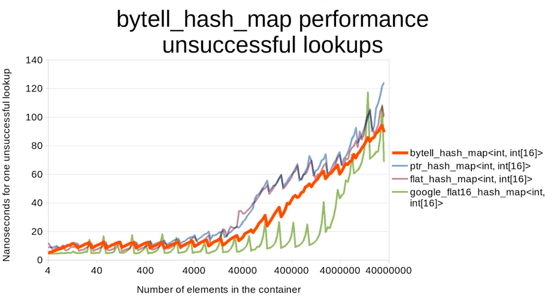

### New Improvements to Hash Table Performance
视频地址如下：
[C++Now 2018: You Can Do Better than std::unordered_map: New Improvements to Hash Table Performance](https://www.youtube.com/watch?v=M2fKMP47slQ)

首先介绍一下c++中的四种数据结构的查找功能的实现：

1. std::unordered_map<int, int>
unordered_map内部实现了一个哈希表，因此其元素的排列顺序是杂乱的，无序的。
哈希表的特性是牺牲了大量的内存，可以较快的实现查找、存储等操作。通过牺牲空间的方法来换查找效率。
```
解决哈希冲突的方法：
- 开放寻址法（Open Addressing)
	* 二次查找(Quadratic Probing) 按顺序检查s + 1^2, s - 1^2, s + 2^2, s - 2^2...
	* 二度哈希(Rehashing/double hashing)，添加时第一次选用hash1函数，如果被占用则选用hash2函数再次hash直至找到空位置
- 链接技术 (chaining)
	* 把哈希到同一个槽中的元素放到一个链表中
```

2. std::map<int, int>
map内部实现了一个红黑树，该结构具有自动排序的功能，因此map内的所有元素都是有序的，红黑树的每一个节点都代表着map的一个元素，因此，map对于查找、删除、添加等功能都相当于对红黑书进行这样的操作。

回忆一下红黑树的性质：
```
- 节点必须是红色或者黑色。
- 根节点必须是黑色。
- 叶节点(NIL)是黑色的。（NIL节点无数据，是空节点）
- 红色节点必须有两个黑色儿子节点。
- 从任一节点出发到其每个叶子节点的路径，黑色节点的数量是相等的。

这些属性是的红黑树具有一个关键的属性：从根节点到最远的叶子节点的路径长与到最近的叶子节点的路径长度不会相差超过2。
每次插入元素时，元素将会被设置为红色节点。
因此红黑树查找的速率基本可以保持O(logn)级别。

```
3. boost::flat_map<int, int>
这是一种基于矢量地图的实现

4. linear search
线性搜索，根据顺序一个个查找

为何讨论hash tables
---
- 有非常庞大的数据量
- std::unordered_map的确有着很大的优化空间，近年来很多人做过提升

为何hash table会慢
---
- Cache Misses：有不好的内存布局
- Long delay to the first comparison:在hash()函数与equal_to()函数之间的时间
- Unnecessary comparisons


What should we measure?
---
- Successful lookup
- Unsuccessful lookup
- Insert
- Erase
- Cache miss or not


#### Optimization 1/7: Integer Modulo
```c
// Takes roughly 9 nanoseconds on his machine
size_t hash_to_index(size_t hash, size_t size)
{
	return hash % size;
}
// Takes roughly 0 nanoseconds on his machine
size_t hash_to_index(size_t hash, size_t size_minus_one)
{
	return hash & size_minus_one;
}
```
使用该方案的效果如图所示：
其中ska::unordered_map<int, int> 为新的方案，可见比std::unordered_map好很多，也好过boost::flat_map

#### Optimization 2/7:Cache Misses
普通的unordered_map排列方式是这样的:
当我们想找到11时，通过hash函数可以找到3的位置，但这个位置并不是我们期望的11，所以根据链表继续想下寻找，从而找到11，这就造成了Cache Misses。
开放寻址法是一个基础的解决方案，我们可以将上图所示的哈希表这样存储:

当我们想找到11时，首先找到3的位置，没有的话继续向下找，立刻就找到了11，这就不会造成Cache Misses了。

google::dense_hash_map就是这样做的，可以看到当数据量很大时他们表现得会比较好，但在数据量小的时候不如ska

#### Optimization 3/7: Back to Linked Lists
考虑在数组中构建链表，即对于上文中描述的哈希表，使用这样的方式来进行存储：

当插入新的元素时，可以表现为：

这样的话也可以减少Cache Misses,它的性能看起来也很不错，如图：


#### Optimization 4/7: Robin Hood Hashing
在这一部分可以将开放寻址法做进一步的优化，我们可以使用一个标志位来判断当前<key，value>的状态：

当我们插入key10时，先找到key2，他是0开头的，所以需要顺延，将key3取出后放到19之后，然后将10插入至原来3的位置变成：

使用这样的方式可以更快的进行查找，效果如下所示：

ska::flat_hash_map为实现方案，可以看到效果有着明显的提升。

max_load_factor也起着较大的作用，这个参数表明何时hash表进行扩展，

因此我们应使用较小的max_load_factor，但更小的不一定为更好的，0.5为选出比较合理地一个值。

#### Optimization 5/7: Google's New flat_hash_map

使用了SSE instruction进行比较，他将之前我们使用的1，2，3转变为H1,H2,H3.当我们希望找到key3时，使用__mm_set1_epi8构建如最左所示的数据结构，使用_mm_cmpeq_epi8()进行比较可以得出左数第三张所示，接下来使用_mm_movemask_epi8得到0b0000000000001000，随后使用_bit_scan_forward()得到数值3，即可得到我们希望的值。
使用这样的方法可以使用一次比较即可得到我们所希望得到的值，这是很好的一个特性。

对于Unsuccessful Lookups而言，这种方法体现了更好的效率：


#### Optimization 6/7: Robin Hood Hashing + SIMD
- Each item is at most 32 elements removed from its ideal slot
	* Otherwise grow the table, rehash, and try inserting again
	* Potential pitfall with bad hash functions
- Metadata is 5 bits for distance + 3 bits of the hash
- On lookup
	* Look at 16 elements at once
	* If not found, look at the next 16 elements
	* If still not found, it's not in the table
性能如图：


#### Optimization 7/7:
在prt_hash_map中需要jump多少次才可得到准确值，通过下图分析可以得出均值为1.46，类似的Unsuccessful lookups的均值为0.93：

所以使用如下图所示的结构来进行存储：

存储之后的实例如图所示：

上面的2，3，1，0等即代表jump distance
其效果如下：


- 对于成功和失败的查找速度都很快
- 内存开销低
- 性能稳定，性能陷阱少

结论：
- Good simple, default choice:
	* Google's flat_hash_map(their SIMD hash table)
	* bytell_hash_map 在几周前刚刚实现，当他更加完善之后会推荐使用这个。
- 特殊情况
	* 需要/不确定 稳定性：ska::unordered_map
	* 查询大多数是失败的情况：Goolgle's flat_hash_map
	* 查询大多数是成功时，需要很多插入操作：Goolgle's flat_hash_map
	* 查询大多数是成功时，不需要很多插入操作，需要考虑内存：bytell_hash_map
	* 查询大多数是成功时，不需要很多插入操作，不需要考虑内存：ska::unordered_map